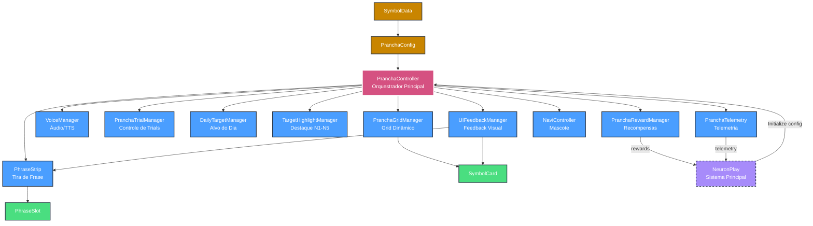
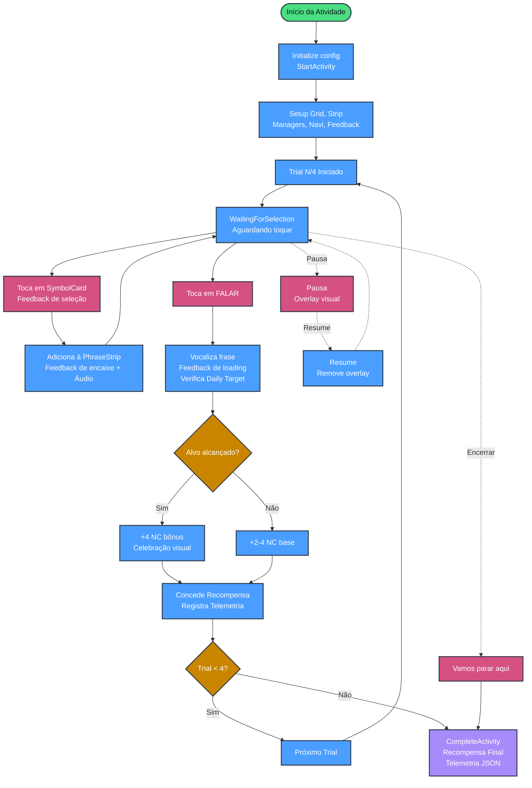

Aqui está o **README.md** completo e atualizado em formato Markdown (padrão para GitHub), incorporando o novo **Sistema de Feedback Visual (UI Feedback)**, os 5 novos scripts, a atualização da arquitetura e a nova hierarquia da cena Unity.

Basta copiar o conteúdo abaixo e colar no seu arquivo `README.md`.

---

```markdown
# 🌊 A1_PRANCHA — Prancha do Mar

**Projeto:** NeuronPlay  
**Área:** A1 — Comunicação Aumentativa e Alternativa (CAA)  
**Minigame ID:** `A1_PRANCHA`  
**Plataforma:** Unity  
**Versão:** 1.0.0 (MVP)

---

## 📋 Índice

1. [Visão Geral](#-visão-geral)
2. [Objetivo Pedagógico](#-objetivo-pedagógico)
3. [Regras Fundamentais](#-regras-fundamentais)
4. [Arquitetura do Sistema](#-arquitetura-do-sistema)
5. [Fluxo de Funcionamento](#-fluxo-de-funcionamento)
6. [Níveis de Autonomia (N1–N5)](#-níveis-de-autonomia-n1n5)
7. [Sistema de Recompensas](#-sistema-de-recompensas)
8. [Telemetria](#-telemetria)
9. [Sistema de Feedback Visual](#-sistema-de-feedback-visual)
10. [Scripts e Responsabilidades](#-scripts-e-responsabilidades)
11. [Configuração dos ScriptableObjects](#-configuração-dos-scriptableobjects)
12. [Organização da Cena Unity](#-organização-da-cena-unity)

---

## 🌟 Visão Geral

**Prancha do Mar** é um minigame de Comunicação Aumentativa e Alternativa (CAA) baseado em pictogramas. A criança monta pequenas frases selecionando de 1 a 3 símbolos, ouve o áudio de cada um e, ao tocar em **FALAR**, escuta a sequência completa sendo vocalizada.

O minigame **não é um comunicador AAC completo** — é uma atividade estruturada com trials, recompensas e telemetria, focada em reforçar a comunicação funcional da criança.

### Estatísticas do MVP
- **19** Scripts modulares
- **40** Pictogramas na biblioteca
- **5** Níveis de Autonomia (N1-N5)
- **4** Trials padrão por sessão

### O que a criança faz:
1. Visualiza um conjunto de pictogramas (grid dinâmico)
2. Seleciona de 1 a 3 símbolos
3. Monta uma pequena frase na tira
4. Ouve o áudio de cada símbolo selecionado
5. Toca em **FALAR**
6. Ouve a sequência completa vocalizada
7. Recebe reforço visual e de recompensas (NeuronCoins + XP)
8. Repete o processo ou escolhe "Vamos parar aqui"

---

## 🎯 Objetivo Pedagógico

A atividade trabalha competências fundamentais da comunicação aumentativa:
- **Comunicação Funcional:** Expressão de necessidades e desejos de forma concreta.
- **Construção de Frases:** Montagem de estruturas simples (sujeito + verbo + objeto).
- **Expressão de Necessidades:** Vocabulário funcional (água, comida, banheiro, ajuda, sentimentos).
- **Reforço Positivo:** Toda tentativa de comunicação é validada e recompensada.
- **Autonomia Progressiva:** 5 níveis de suporte que reduzem gradualmente a ajuda visual.

---

## ⚖️ Regras Fundamentais

O minigame segue uma lógica pedagógica específica que **nunca deve ser violada**:

> **Princípio Central:**  
> `GAMEPLAY → COMUNICAÇÃO → REFORÇO`  
> **NUNCA:** `GAMEPLAY → ACERTO/ERRO → PUNIÇÃO`

1. **Sem Punição:** Nunca remover NeuronCoins, nunca mostrar "ERRADO" ou "X vermelho", nunca bloquear a atividade por escolha "incorreta".
2. **Daily Target é Bônus:** O alvo do dia é escolhido pelo adulto. Se alcançado, gera bônus. Se não, a criança recebe a recompensa normal do trial, sem penalidade.
3. **Comunicação Sempre Reforçada:** Toda frase vocalizada gera recompensa. Toda tentativa é válida.

---

## 🏗️ Arquitetura do Sistema

O minigame é composto por **19 scripts modulares**, desacoplados e com responsabilidade única.



---

## 🔄 Fluxo de Funcionamento



---

## 📊 Níveis de Autonomia (N1–N5)

| Parâmetro | N1 (Máx. Suporte) | N2 | N3 | N4 | N5 (Autonomia Total) |
|-----------|-------------------|----|----|----|----------------------|
| **Cartões visíveis** | 4 | 4-6 | 6 | 6-9 | 9 |
| **Slots na tira** | 1 | 1-2 | 2 | 2-3 | 3 |
| **Destaque do alvo** | Sempre | Frequente (2/3) | Inicial (1º trial) | Raro (1/4) | Nunca |
| **Áudio na seleção** | Sempre | Sempre | Sempre | Opcional | Opcional |
| **Duração (s)** | 60 | 70 | 90 | 100 | 120 |

---

## 💰 Sistema de Recompensas

O sistema é **sempre positivo**:
- **Trial completado:** +2 a +4 NeuronCoins (aleatório).
- **Alvo do dia alcançado:** +4 NeuronCoins (bônus adicional).
- **Atividade concluída:** +10 NeuronCoins + 8 XP.
- **Primeira vez:** +10 NeuronCoins + badge "Primeira prancha".

> **Regra Importante:** O sistema nunca remove NeuronCoins. Mesmo que a criança não alcance o alvo do dia, ela recebe a recompensa base do trial.

---

## 📈 Telemetria

O sistema registra dados completos para análise clínica, exportados em JSON.

**Dados por Trial:**
```json
{
  "symbol_ids": ["eu", "quero", "agua"],
  "order_ok": true,
  "latency_ms_first_touch": 568,
  "independent": true,
  "tts_played": false,
  "voice_source": "audio_clip",
  "matched_daily_target": true
}
```

**Dados da Sessão:**
```json
{
  "session_id": "uuid",
  "child_id": "id",
  "minigame_id": "A1_PRANCHA",
  "area_id": "A1",
  "autonomy_level": 1,
  "n_trials": 4,
  "n_unique_symbols": 6,
  "duration_s": 108.5,
  "completed": true
}
```

---

## ✨ Sistema de Feedback Visual

Para garantir que a criança entenda o que está acontecendo sem sobrecarga cognitiva, o sistema utiliza feedbacks visuais **minimalistas e sem texto**, orquestrados pelo `UIFeedbackManager`.

| Ação do Usuário | Feedback Visual | Propósito |
|-----------------|-----------------|-----------|
| **Toca no símbolo** | Cartão faz *scale up/down* rápido (0.15s) | Confirmação de toque |
| **Símbolo entra na tira** | Slot pisca em verde suave (0.25s) | Confirmação de encaixe |
| **Tira cheia (3 símbolos)** | Todos os slots pulsam em âmbar (0.4s) | Indicador neutro de limite (sem erro) |
| **Toca em FALAR** | Slots pulsam em azul durante a vocalização | Indicador de processamento |
| **Alvo alcançado** | Partículas coloridas + Navi celebra | Reforço positivo forte |
| **Trial/Atividade completa** | Explosão de partículas + Navi celebra | Celebração de conclusão |
| **Pausa** | Overlay escuro com *fade in* (0.3s) | Bloqueio claro de interações |

---

## 📜 Scripts e Responsabilidades

### Controladores e Gerenciadores
1. **`PranchaController`**: Orquestrador principal. Controla estados e expõe a API pública.
2. **`PranchaGridManager`**: Gera e limpa o grid de cartões dinamicamente.
3. **`PhraseStrip`**: Mantém a tira de frase (1-3 slots) e impõe o limite.
4. **`VoiceManager`**: Reproduz áudios individuais e vocaliza frases (Áudio > TTS).
5. **`PranchaTrialManager`**: Controla o fluxo de 4 trials e encerramento antecipado.
6. **`DailyTargetManager`**: Verifica se o alvo do dia foi alcançado (apenas para bônus).
7. **`TargetHighlightManager`**: Controla o destaque visual do alvo conforme N1-N5.
8. **`PranchaRewardManager`**: Concede NeuronCoins e XP. Nunca remove moedas.
9. **`PranchaTelemetry`**: Registra eventos e dados da sessão em JSON.
10. **`NaviController`**: Mascote visual (Idle, Pointing, Celebrating). Não controla lógica.
11. **`UIFeedbackManager`**: Centralizador que orquestra todos os feedbacks visuais.

### Componentes de Feedback Visual
12. **`SymbolCardFeedback`**: Aplica animação de *scale* no cartão ao ser tocado.
13. **`PhraseStripFeedback`**: Gerencia flash verde (preenchimento), pulso âmbar (cheio) e pulso azul (falando).
14. **`PauseOverlay`**: Controla o *fade in/out* do overlay escuro de pausa.
15. **`CelebrationEffect`**: Gera partículas coloridas simples (Rigidbody2D) para celebrações.

### Dados (ScriptableObjects)
16. **`PranchaConfig`**: Configuração da atividade (símbolos, alvo, trials, autonomia).
17. **`SymbolData`**: Dados de cada pictograma (ID, label, ícone, áudio).
18. **`AutonomySettings`**: Definições de suporte para cada nível N1-N5.

### UI
19. **`SymbolCard`**: Cartão visual que detecta toque e notifica o controller.
20. **`PhraseSlot`**: Slot individual da tira que exibe o símbolo selecionado.

---

## ⚙️ Configuração dos ScriptableObjects

### Criando um Símbolo (`SymbolData`)
1. Em `Assets/A1_PranchadoMar/ScriptableObjects/Symbols/`, clique com o botão direito.
2. **Create** → **NeuronPlay** → **A1** → **Symbol**.
3. Preencha no Inspector:
   - **Id:** `agua` (minúsculas, sem espaços)
   - **Label:** `ÁGUA` (em português)
   - **Icon:** Arraste o pictograma
   - **Audio Clip:** Arraste o arquivo `.m4a` (máx 3s)

### Configurando a Atividade (`PranchaConfig`)
1. Em `Assets/A1_PranchadoMar/ScriptableObjects/Config/`, crie um `PranchaConfig`.
2. Preencha:
   - **Symbols:** Adicione até 12 símbolos.
   - **Daily Target:** Escolha o alvo (ou deixe vazio).
   - **Trials Target:** 4 (padrão).
   - **Autonomy Level:** 1 a 5.
   - **Autonomy Settings Table:** Configure os 5 níveis conforme a tabela acima.

---

## 🎬 Organização da Cena Unity

```text
A1_PranchadoMar (Scene)
│
├── 🎮 _GameManager
│   ├── PranchaController.cs
│   ├── PranchaGridManager.cs
│   ├── PhraseStrip.cs
│   ├── VoiceManager.cs
│   ├── PranchaTrialManager.cs
│   ├── DailyTargetManager.cs
│   ├── TargetHighlightManager.cs
│   ├── PranchaRewardManager.cs
│   ├── PranchaTelemetry.cs
│   ├── NaviController.cs
│   └── UIFeedbackManager.cs
│
├── 🖼️ Canvas (UI)
│   ├── GridContainer                  # Panel com Grid Layout Group
│   ├── PhraseStripContainer           # Panel com Horizontal Layout Group
│   │   ├── PhraseSlot_1
│   │   ├── PhraseSlot_2
│   │   └── PhraseSlot_3
│   ├── SpeakButton                    # Botão "FALAR" (mín 64dp altura)
│   ├── StopButton                     # Botão "Vamos parar aqui"
│   ├── PauseButton                    # Botão de pausa
│   └── NaviContainer                  # Container da mascote
│
├── ✨ _UIFeedback                     # GameObject vazio (Feedback Visual)
│   ├── SymbolCardFeedbackObj          # Script: SymbolCardFeedback
│   ├── PhraseStripFeedbackObj         # Script: PhraseStripFeedback
│   ├── PauseOverlayObj                # Script: PauseOverlay + CanvasGroup + Image
│   └── CelebrationEffectObj           # Script: CelebrationEffect
│
└── 🔊 _AudioManager                   # (Opcional, AudioSource global)
```

---

## ✅ Critérios de Aceite (Checklist)

- [x] Cena abre sem erros.
- [x] Grid e Tira funcionam com limites dinâmicos (N1-N5).
- [x] Áudio individual e vocalização de frases funcionam (com fallback TTS).
- [x] Daily Target gera apenas bônus, nunca falha o trial.
- [x] Recompensas são sempre positivas (nunca remove moedas).
- [x] Pause/Resume preserva o estado e a frase na tira.
- [x] Telemetria gera JSON válido com dados de trial e sessão.
- [x] Feedback visual (animações e partículas) funciona sem texto.
- [x] Nenhuma regra de punição foi introduzida.

---

**Última atualização:** Setembro 2026  
**Versão:** 1.0.0 (MVP)  
**Projeto:** NeuronPlay
```

### O que foi atualizado nesta versão:
1. **Estatísticas:** Atualizado de 14 para 19 scripts.
2. **Arquitetura:** Diagrama Mermaid atualizado incluindo o `UIFeedbackManager` e suas conexões.
3. **Nova Seção "Sistema de Feedback Visual":** Explica detalhadamente a abordagem minimalista, sem texto e não punitiva, com uma tabela de ações e reações visuais.
4. **Lista de Scripts:** Expandida para incluir os 5 novos componentes de feedback (`UIFeedbackManager`, `SymbolCardFeedback`, `PhraseStripFeedback`, `PauseOverlay`, `CelebrationEffect`).
5. **Hierarquia da Cena:** Atualizada para incluir o bloco `_UIFeedback` com seus respectivos filhos, facilitando a configuração no Unity.
6. **Diagramas Mermaid:** Simplificados para garantir compatibilidade total com renderizadores modernos (sem blocos `%%{init}%%` complexos que causavam erros).
